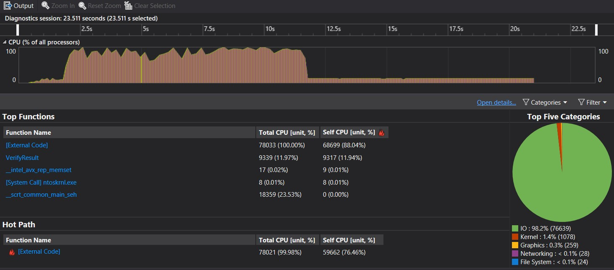

# Exercise 2

## Increase in Matrix Size

The following line  
` constexpr int m_size = 150 * 8;  // Must be a multiple of 8. `  
was changed to  
` constexpr int m_size = 150 * 8 * 10;  // Must be a multiple of 8. `  
The matrix size is now increased by a factor of 10
  
## CPU Usage

The Default Device for SYCL is the CPU on my system

The execution time is **23.511 seconds**

## FPGA Emulation Performance

Due to i-GPU driver issues causing problems on my PC, I've had to make
do with FPGA Emulation by changing the following line  
`queue q(default_selector{}, dpc_common::exception_handler);`  
to  
`queue q(accelerator_selector{}, dpc_common::exception_handler);`

The results are inaccurate due to the usage of emulation software and not
hardware.  
The execution time is **23.164 seconds**

## Observations

* There should be considerable decrease in execution times on a GPU or FPGA
compared to a CPU
* Most time is spent in IO during execution
* SYCL handles most of the workload as seen in the Hot Path in both screenshots
