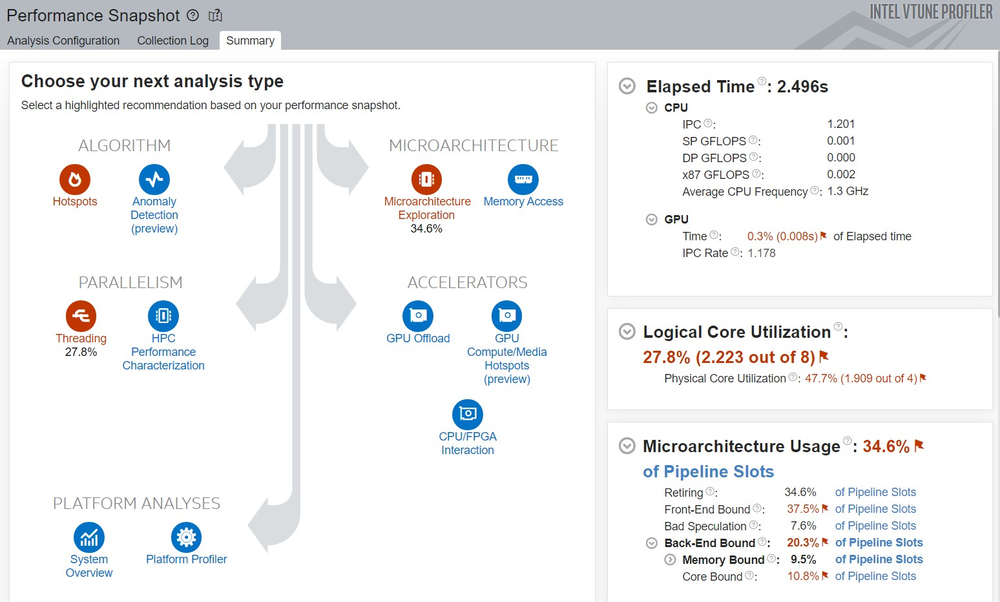
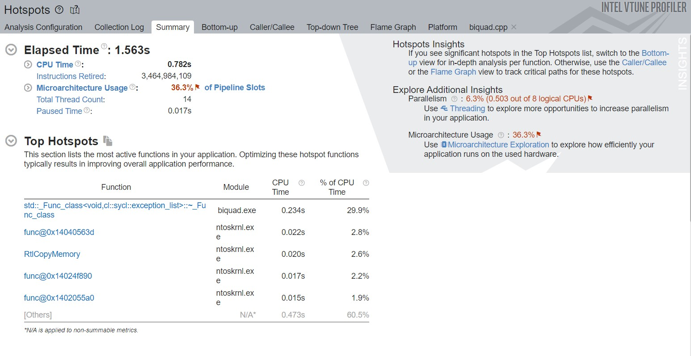
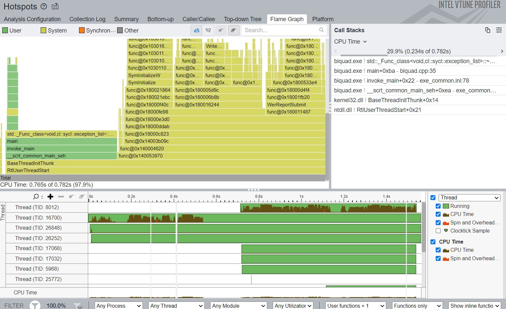
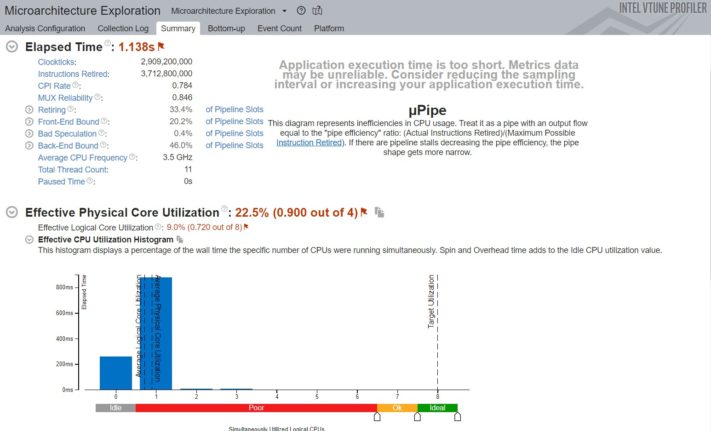
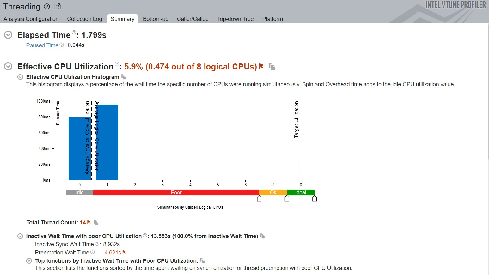

# Exercise 4 - Intel VTune Profiler

*As mentioned before Windows is riddled with driver and linking issues, hence
the following analysis may not be completely accurate.*

## Performance Snapshot

The inital performance snapshot shows 3 main areas of improvement:

- HotSpots in the algorithm used
- Low Microarchitecture usage
- Low Thread-level parallelism

## Hotspot analysis

Hotspot analysis with Hardware Event-based sampling shows an internal SYCL
functional class and kernel functions taking up most of the CPU time.

*Flame graph of the application*

## Microarchitecture Exploration

The microarchtecture analysis was inaccurate due to linking errors when calling
the `.exe` file from VTune. Handling static-linking in Windows is a nightmare :(

## Threading Analysis

The Threading analysis shows high utilization of locks in tbb.dll hence the
memory management could be improved.

## Additional Notes

Further improvements can be seen by:

- Switching to **hipSYCL** which supports NVidia CUDA backend to enable usage
of the dedicated GPU on my System
- Switching to a system running bare-metal Linux to allow accurate analysis and
pain-free development
