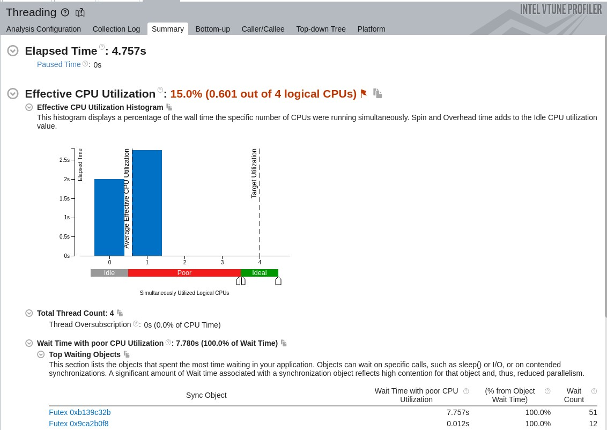

# Exercise 4 - Intel VTune Profiler

*As mentioned before Windows is riddled with driver and linking issues, hence
the following analysis may not be completely accurate.*

## Performance Snapshot

The inital performance snapshot shows 3 main areas of improvement:

- HotSpots in the algorithm used
- Low Microarchitecture usage
- Low Thread-level parallelism

## Hotspot Analysis

Hotspot analysis with Hardware Event-based sampling shows an internal SYCL
functional class and kernel functions taking up most of the CPU time.

*Flame graph of the application*

## Microarchitecture Exploration

The microarchtecture analysis was inaccurate due to linking errors when calling
the `.exe` file from VTune. Handling static-linking in Windows is a nightmare :(

## Threading Analysis

The Threading analysis shows high utilization of locks in tbb.dll **(Thread
Building Blocks)** hence the memory management could be improved.

---

## *The following section documents my Profiling results on a Linux VM*

*Owing to the overhead posed by Virtualization,
the following analysis may not be completely accurate.*  
The profiled program is the implementation in Exercise 3 working on a
`(2500,1)` column vector.

## Performance Snapshot on a Linux VM

The code performs well by default. Let's analyse the Hot Spots.

## Hotspot Analysis on a Linux VM

We can observe that the intial set-up for the `queue` and `memmove` take up a
lot of execute time. Since `tbb_parallel_for` executes on the CPU, it shows up
as a hotspot.
Memory accesses tend to be a bottle neck in accelerated applications, so the
most obvious improvement would be to use a GPU backend.

## Threading Analysis on a Linux VM

We see that the Threads are held waiting by futexes (Fast User-Space Mutexes),
a synchonization mechanism in the kernel. This may be due to the VM being
allocated 4 vCPUs in total. We can probably see performance improvements on
direct hardware.

## Additional Notes

Further improvements can be seen by:

- Switching to **hipSYCL** which supports NVidia CUDA backend to enable usage
of the dedicated GPU on my System
- Switching to a system running bare-metal Linux to allow accurate analysis and
pain-free development
